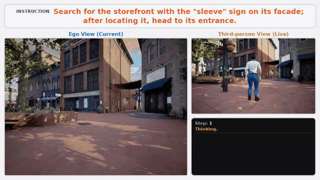
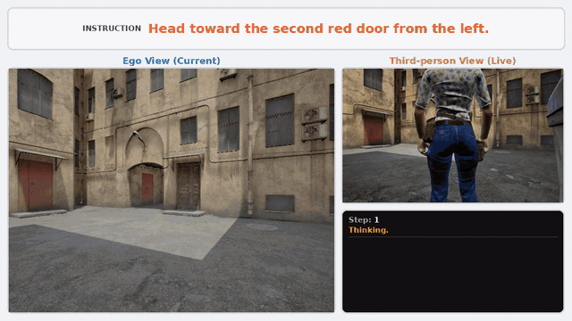
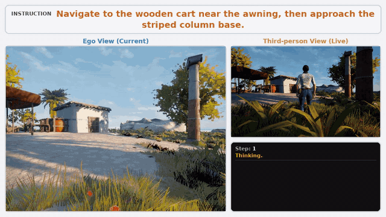
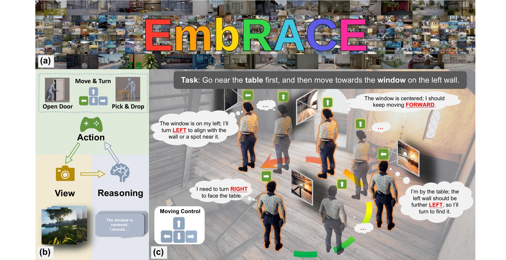
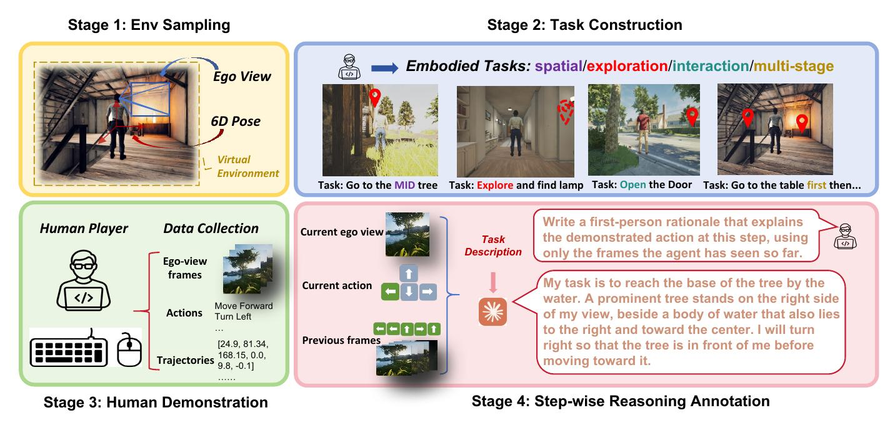

<h1 align="center">
  <strong>EmbRACE</strong><br>
  Embodied Reasoning and Action in Complex Environments
</h1>

<p align="center">
  <a href="https://mxlin043.github.io/EmbRACE/"></a>
  <a href="https://arxiv.org/abs/2507.10548"></a>
  <a href="https://huggingface.co/datasets/mxlin043/EmbRACE"></a>
  <a href="https://huggingface.co/spaces/mxlin043/EmbRACE-Viewer"></a>
  <a href="https://huggingface.co/mxlin043/EmbRACE-Qwen3.5-9B"></a>
</p>

---

## 📌 Overview

**EmbRACE** is a dataset of **3,421** human demonstrations recorded from the
egocentric view in **55** photorealistic Unreal Engine environments, indoor and
outdoor. Each of its **48,264** steps carries a rationale that states what the
action was based on and is verified against the frames. A benchmark of **686**
tasks in **7** held-out environments runs models in the closed loop and scores
them on the final position and on the door and object states.

Each step carries:

- 👁️ the egocentric view before the action
- 📝 the task instruction
- 🕹 the action, one of 11 discrete actions
- 📍 the agent pose, and the door or object state in interaction tasks
- 💬 the rationale

The tasks cover six types:

- 🎯 **Basic**: the target is visible from the start.
- 🧭 **Exploration**: the target is out of view and has to be searched for.
- 🧠 **Dynamic Spatial-Semantic**: the target is specified relationally or
  ordinally, for example "the second chair from the left".
- 🗺️ **Multi-stage**: two targets are reached in order.
- 🚪 **Open Door**: a door is opened.
- 📦 **Pick & Drop**: an object is picked up and released beside a landmark.

Frontier models score highest when the target is in view from the start, lower
on all three task types that depend on an earlier observation, and below half
when the target has to be searched for or returned to. Fine-tuning on EmbRACE
takes four open models of 2B to 9B parameters from **3% to 8%** overall to
**57% to 68%**. Relative to training on the same trajectories without them, the
rationales raise success by 7% to 18% across task types and halve the fraction
of episodes that return to views already seen.

---

## 🔁 Step-by-Step Closed-Loop Reasoning

Qwen3.5-9B fine-tuned on EmbRACE, on three held-out benchmark tasks. The model
sees only the egocentric view on the left of each clip and writes a rationale
before every action. The third-person view is for the reader.

<table>
  <tr>
    <td align="center" width="33%"><br>🧭 Exploration</td>
    <td align="center" width="33%"><br>🧠 Dynamic Spatial-Semantic</td>
    <td align="center" width="33%"><br>🗺️ Multi-stage</td>
  </tr>
</table>

---

## 📊 Dataset Overview

<div align="center">
  
</div>

(a) Photorealistic Unreal Engine environments. (b) The closed loop: at each step
the agent receives an egocentric view, produces a rationale and issues one
action. (c) A human demonstration with the view, rationale and action at each
step.

| | Dataset | Benchmark |
|---|---:|---:|
| Environments | 55 | 7 |
| Tasks | 3,421 | 686 |
| 🎯 Basic | 646 | 116 |
| 🧭 Exploration | 591 | 117 |
| 🧠 Dynamic Spatial-Semantic | 686 | 114 |
| 🗺️ Multi-stage | 644 | 106 |
| 🚪 Open Door | 226 | 109 |
| 📦 Pick & Drop | 628 | 124 |
| Steps of the human demonstrations | 48,264 | 10,552 |
| Steps with a rationale | 48,264 | 0 |

---

## 🛠 Dataset Construction Pipeline

Every stage ends with a check by an annotator other than the one who produced
its output.

1. **Env Sampling.** Annotators sample 6-DoF first-person start poses.
2. **Task Construction.** Annotators write an instruction for each start pose,
   and a second annotator checks that its target exists, is reachable, fits the
   task type and is the only object matching the description.
3. **Human Demonstration.** Annotators record each task from the egocentric
   view. Every recording must replay to the same poses on a freshly loaded map.
4. **Step-wise Reasoning Annotation.** Claude Opus 4.8 writes a rationale for
   every step from the frames before it, and annotators verify every rationale
   against the frames.

<div align="center">
  
</div>

---

## 📂 Dataset and Code

| | |
|---|---|
| 🤗 [**Dataset**](https://huggingface.co/datasets/mxlin043/EmbRACE) | the 4,107 tasks, their human demonstrations, the rationales of the dataset and the success regions of the benchmark, one archive per environment, under CC BY-NC 4.0 |
| 🔍 [**Viewer**](https://huggingface.co/spaces/mxlin043/EmbRACE-Viewer) | every task of the dataset and the benchmark, step by step in the browser |
| 🧠 [**Model**](https://huggingface.co/mxlin043/EmbRACE-Qwen3.5-9B) | Qwen3.5-9B fine-tuned on the dataset, under CC BY-NC 4.0 |
| 💻 **Code** (this repository) | the simulator setup, the web playground, the evaluator and the scorer, under Apache 2.0 |

```
embrace/
  core/            agent / simulator API on top of UnrealCV
  configs/         per-map settings (exposure, spawn pose), pick-and-drop objects
  web_ui/          playground.py      browser play UI
                   results.py         results viewer
  eval/            eval_vlm.py        VLM evaluator
                   score_metrics.py   metrics
                   success_region.py  success regions and the success predicate
                   check_reproducibility.py   reproducibility check
  vlm/             client.py          VLM client and model routing
datas/             filled by scripts/download_data.sh
  benchmark/task/<Map>/<task>.json                  benchmark tasks
  benchmark/success_region/<Map>/<task>/area.json   their success regions
  benchmark/trajectory/<Map>/<task>/                reference human demonstrations
  dataset/task/<Map>/<task>.json                    dataset tasks
  dataset/trajectory/<Map>/<task>/                  demonstrations with rationales
reproducibility/   task/ and trajectory/ of the three demonstrations the check replays
configs/           vlm_models.yaml    per-model endpoint, key, sampling
ue_config/         Engine / UnrealCV configuration, copied into UnrealZoo at every launch
scripts/           download, launch, check, play, evaluate
```

---

## 📋 1. Requirements

| | |
|---|---|
| OS | Linux x86-64 (tested on Ubuntu 20.04 / 22.04) |
| GPU | NVIDIA GPU with Vulkan support, 8 GB+ VRAM per UE instance |
| Driver | NVIDIA driver **>= 570** recommended (UE 5.6 warns on older drivers; on 535 the render thread may stall) |
| Disk | ~75 GB for UnrealZoo, ~150 GB free while unpacking |
| RAM | 16 GB+ per UE instance |
| Python | 3.10 |

`vulkaninfo --summary` should list your NVIDIA GPU (install `vulkan-tools` if
missing).

## 🐍 2. Python environment

```bash
conda create -n embrace python=3.10 -y
conda activate embrace
pip install -r requirements.txt
```

## 🌍 3. Download UnrealZoo and the data

EmbRACE runs on the [UnrealZoo](https://github.com/UnrealZoo/unrealzoo-gym)
**UE5.6 Linux package v3.0.2** (73.5 GB), from
[Hugging Face](https://huggingface.co/datasets/UnrealZoo/UnrealZoo_UE5) or its
[ModelScope mirror](https://modelscope.cn/datasets/UnrealZoo/UnrealZoo-UE5).
Other versions have different maps and lighting and do not reproduce the
benchmark. UnrealZoo is distributed by its authors under its own license and is
not redistributed here. The script verifies the checksum and unpacks the
package into `./UnrealEnv` (or `$UNREALZOO_ROOT`):

```bash
bash scripts/download_unrealzoo.sh              # from Hugging Face
bash scripts/download_unrealzoo.sh modelscope   # from ModelScope
```

A package downloaded by hand can go in either of two places, and every script
finds it in both:

* inside the repository, as `UnrealEnv/UnrealZoo_UE5_6_Linux_v3.0.2/`, where the
  script above puts it
* anywhere else, with `UNREALZOO_ROOT` set to the folder that holds
  `UnrealZoo_UE5_6_Linux_v3.0.2/` or to that folder itself, for example
  `export UNREALZOO_ROOT=/data/UnrealEnv` in `~/.bashrc`

### 📦 The EmbRACE data

`download_data.sh` downloads [mxlin043/EmbRACE](https://huggingface.co/datasets/mxlin043/EmbRACE)
per environment into `datas/` and checks every file against the release
checksums. Evaluation needs only the benchmark.

```bash
bash scripts/download_data.sh benchmark                  # the 686 benchmark tasks, ~1.6 GB
bash scripts/download_data.sh                            # the benchmark and the dataset, ~7.4 GB
bash scripts/download_data.sh benchmark IndustrialArea   # one environment
```

To download by hand, fetch the archives in `packed/` and extract them into
`datas/`. The browsable files on the Hub page carry a `task_` prefix that the
code does not expect.

```bash
hf download mxlin043/EmbRACE --repo-type dataset --local-dir datas/.hf --include "packed/benchmark/*"
for f in datas/.hf/packed/benchmark/*.tar; do tar -xf "$f" -C datas; done
```

## 🚀 4. Launch the simulator

```bash
bash scripts/run_ue_server.sh 9000              # windowed (needs a display)
bash scripts/run_ue_server.sh 9000 --headless   # off-screen, for servers
```

The argument is the UnrealCV port. `GPU_ID` (default 0) and `RES_X` / `RES_Y`
are read from the environment. The first start compiles shaders for a few
minutes. A UE instance serves one client at a time, so parallel evaluation runs
one instance per port. Every launch copies `ue_config/` into the package, so all
runs share the same settings: a fixed 20 Hz simulation step, deterministic
physics, Lumen and auto-exposure off, FXAA, and a 640x480 ego camera with a 90
degree FOV.

### ✅ Reproducibility check

```bash
bash scripts/check_reproducibility.sh
```

replays the three demonstrations in `reproducibility/` (Dynamic
Spatial-Semantic, Open Door, Pick & Drop) through the evaluator and compares
every agent pose, door state and object pose with the recording. A correct
installation reproduces them exactly, so the output ends with a PASS for every
demonstration:

```
[PASS] SuburbNeighborhood_Day/x000269_y-000779_z000116_t4_a  T4  14 actions  agent_max=0.000 uu  door states match
[PASS] Supermarket/x-001883_y002579_z000087_t2_a  T2  27 actions  agent_max=0.000 uu
[PASS] VictorianTrainStation/x003143_y-002450_z000142_t5_a_p  T5  15 actions  agent_max=0.000 uu  pd_max=0.000 uu
[>>>] 3/3 demonstrations reproduced exactly
```

A demonstration that does not reproduce reads FAIL, and the script then exits
with an error.

Extra arguments go to the checker, so `--task_dir datas/benchmark/task
--traj_dir datas/benchmark/trajectory --map IndustrialArea` replays the benchmark
demonstrations of one environment instead.

## 🎮 5. Web playground

```bash
bash scripts/run_playground.sh IndustrialArea 9000 8080   # windowed UE and the page at http://localhost:8080
# with a simulator already running on port 9000:
python -m embrace.web_ui.playground --port 9000 --map IndustrialArea --web_port 8080
```

Selecting a task places the agent at its start pose, set up as in the
evaluation, and any environment can also be explored freely. Nothing is scored.
**Standard** mode takes one discrete step per key press, like a model, and
**Free Move** keeps walking or turning while a key is held. The page binds to
`127.0.0.1`, so pass `--host 0.0.0.0` to open it from another machine.

| Key | Action | Key | Action |
|---|---|---|---|
| I / W | forward | &uarr; | look up |
| K / S | backward | &darr; | look down |
| J / A / &larr; | turn left | O | open door |
| L / D / &rarr; | turn right | P | pick |
| Backspace | back to start | N | drop |

## 🤖 6. Evaluating a VLM

After sections 2 and 3, one command evaluates a model on the benchmark and
scores it:

```bash
OPENAI_API_KEY=... bash scripts/run_eval.sh gpt-5.5   # an API model, with its key (6.3)
bash scripts/run_eval.sh qwen35-9b                    # an open-weight model served with vLLM (6.4)
```

The argument is the model's name in this table, which selects the endpoint, the
key and the sampling settings in `configs/vlm_models.yaml`:

| Model in the paper | `--model` | Served by |
|---|---|---|
| GPT-5.5 | `gpt-5.5` | OpenAI API, key in `OPENAI_API_KEY` |
| Claude Opus 4.8 | `claude-opus-4-8` | Anthropic API, key in `ANTHROPIC_API_KEY` |
| Gemini 3.1 Pro Preview | `gemini-3.1-pro-preview` | Google API, key in `GEMINI_API_KEY` |
| Qwen3.5-2B | `qwen35-2b` | vLLM serving `Qwen/Qwen3.5-2B` |
| Qwen3.5-9B | `qwen35-9b` | vLLM serving `Qwen/Qwen3.5-9B` |
| InternVL3-8B | `internvl3-8b` | vLLM serving `OpenGVLab/InternVL3-8B` |
| GLM-4.1V-9B | `glm-4.1v-9b` | vLLM serving `zai-org/GLM-4.1V-9B-Thinking` |

The script starts a headless UE instance, runs the benchmark tasks in
`datas/benchmark/task`, writes every episode to `runs/<Map>/<task>/<model>/`
and prints a score table, which it also saves as `runs/report_<model>.json`.
Run every command from the repository root.

### 6.1 Tasks

A benchmark task is one file, `datas/benchmark/task/<Map>/<task>.json`, named
after its start position (x, y, z in uu), its type and a letter. Pick & Drop
names end in `_p` (pick) or `_pd` (pick and drop).

```json
{
  "Instruction": "Pick up the green bell pepper from the green wooden crate stack, then place it near the door.",
  "Type": 5,
  "Start_Pose": [-92.967, -2274.345, 561.15, 0, 125.12, 0],
  "PD_ID": 2,
  "PD_Size": 5.0,
  "PD_Type": "pd",
  "PD_Start_Pose": [-451.816, -2087.714, 599.488, -45, -115.283, 90]
}
```

`Start_Pose` is `[x, y, z, pitch, yaw, roll]` in Unreal units (1 uu = 1 cm) and
degrees. `Type`: 0 Basic, 1 Exploration, 2 Dynamic Spatial-Semantic,
3 Multi-stage, 4 Open Door, 5 Pick & Drop. Pick & Drop tasks add the object
(`PD_ID` from `embrace/configs/pd_config.json`, `PD_Size`), `PD_Type` and the
object's start pose. An optional `Exposure` overrides the map default in
`embrace/configs/maps.json`.

The scorer reads `datas/benchmark/success_region/<Map>/<task>/area.json`: per
stage (`final`, and `midway` for Multi-stage), the target footprints and the
region the agent must stand in as XY polygons in uu, the reference Z, and the
shortest-path length for SPL. A task without `area.json` is run but not scored.

### 6.2 Protocol

`embrace/eval/eval_vlm.py` implements the protocol of all reported results:

* one multi-turn conversation per task. The system prompt holds the instruction
  and the action space (`MoveForward, MoveBackward, TurnLeft, TurnRight,
  LookUp, LookDown, OpenDoor, Pick, Drop, MidwayTarget, Finish`) and never names
  the task type
* the initial observation and the 13 most recent ones are kept, at most 14
  images per request, each followed by the model's answer to it
* the model answers `<think>...</think><action>ACTION</action>`, or with
  `<reasoning>` for the open-weight models, since Qwen3 reserves `<think>`
* an invalid action is asked again up to 3 times, then Idle is recorded. A task
  ends at `Finish` or after 60 actions

### 6.3 Model routing: `configs/vlm_models.yaml`

For `--model NAME` the evaluator takes the first entry under `models:` whose
`match` fits `NAME`, and merges
`defaults < providers[entry.provider] < sampling preset < entry < CLI flags`.

| Key | Meaning |
|---|---|
| `protocol` | `openai` (chat/completions) or `anthropic` (messages) |
| `api_base` | base URL of the endpoint |
| `api_key_env` | name of the environment variable holding the key (`null`: no auth) |
| `api_model` | model id sent in the request (default: `NAME`) |
| `temperature`, `max_tokens`, `sampling` | sampling; `null` means "do not send" |
| `extra_body` | extra request fields, e.g. `chat_template_kwargs` |
| `reasoning_tag` | `think` or `reasoning`, the tag the model is asked to use |
| `guided_regex` | constrain the reply format with vLLM structured outputs |

API keys come from the environment variable named in `api_key_env` and are never
stored in the file. `NAME` also names the results folder. The shipped file has
an entry for every model in the table of section 6:

```bash
export OPENAI_API_KEY=...      # gpt-5.5
export ANTHROPIC_API_KEY=...   # claude-opus-4-8
export GEMINI_API_KEY=...      # gemini-3.1-pro-preview
bash scripts/run_eval.sh gpt-5.5
bash scripts/run_eval.sh claude-opus-4-8
bash scripts/run_eval.sh gemini-3.1-pro-preview
```

`OPENAI_BASE_URL` / `ANTHROPIC_BASE_URL` point a provider at a compatible
gateway. Another model needs an entry in the file, or `--api_base URL
[--protocol openai|anthropic]`.

### 6.4 Open-weight models with vLLM

Serve the checkpoint from the table in section 6 under its `--model` name, on a
GPU of its own:

```bash
pip install vllm
CUDA_VISIBLE_DEVICES=0 vllm serve Qwen/Qwen3.5-9B \
    --served-model-name qwen35-9b --host 127.0.0.1 --port 8000 \
    --dtype bfloat16 --max-model-len 32768 \
    --limit-mm-per-prompt '{"image": 16}' --trust-remote-code
GPU_ID=1 bash scripts/run_eval.sh qwen35-9b   # UE on the other GPU
```

`--max-model-len` must hold a full request of about 16k tokens, or the reply is
cut off before `<action>`. For a server on another host, set
`VLLM_API_BASE=http://host:port/v1`.

### 6.5 Running the evaluator directly

With a UE instance already running:

```bash
python -m embrace.eval.eval_vlm --port 9000 --model gpt-5.5 \
    --map IndustrialArea --task_types 0 1 --save_dir runs
```

| Flag | Meaning |
|---|---|
| `--model` | route name in `configs/vlm_models.yaml`; also the results folder |
| `--vlm_config` | another routing file |
| `--api_base`, `--api_key`, `--protocol` | override the route |
| `--map` | map(s) to evaluate (default: every map folder in `--task_dir`) |
| `--task_dir` | benchmark tasks, one sub-folder per map (default `datas/benchmark/task`) |
| `--save_dir` | result root (default `runs`) |
| `--task_types` | subset of task types 0-5 |
| `--shard i/n` | take every n-th task starting at i, to split a map across n UE instances |
| `--window` | recent observations kept (default 13) |
| `--max_steps` | action budget per task (default 60) |
| `--no_rationale` | ablation: actions only, no reasoning |
| `--pick_view_hint on\|off` | tell the model that the view shows its hands for one frame after `Pick` (default `on`) |
| `--show` | show the ego view in an OpenCV window |

Each task writes `runs/<Map>/<task>/<model>/infos.json` and its frames. Finished
tasks are skipped on rerun, and a task abandoned because the API stayed
unreachable resumes from its cached actions.

### 6.6 Scoring

```bash
python -m embrace.eval.score_metrics --runs-root runs --report runs/report.json
```

prints the metrics per model and task type and writes `metrics.json` next to
each episode.

* **Success**: `Finish` is the last action and the agent stands in the success
  area, the XY footprint of the target dilated by 2.2 m, within 1 m in Z.
  Multi-stage also requires `MidwayTarget` inside the intermediate area, Open
  Door an open door at `Finish`, and Pick & Drop the object picked up and then
  held at `Finish` (pick) or dropped inside the destination area (pick and drop).
* **SR** success rate, **OS** oracle success (the goal state reached at any
  step), **NE** final XY distance to the target footprint in metres, **TL**
  number of actions, **SPL** success weighted by path length.

### 6.7 Browsing results

```bash
python -m embrace.web_ui.results --runs runs     # then open http://localhost:8090
```

lists every benchmark task with each model's success or failure, walks through
an episode step by step (egocentric view, reasoning, action), puts two models
side by side and tabulates success per task type. It rereads `runs/` every
10 s, so it also follows an evaluation in progress. Pass `--host 0.0.0.0` to
open it from another machine.

## 🔧 7. Troubleshooting

* **UE exits at once or the window stays black**: check `ue_<port>.log`, Vulkan
  (`vulkaninfo`) and the driver version (>= 570).
* **`Port ... already in use`**: pick another port.
* **Python cannot connect**: the packaged UnrealCV server accepts one TCP
  client per UE lifetime. Local clients fall back to its Unix socket
  automatically. From another machine, restart the UE instance first.
* **`GameThread timed out waiting for RenderThread`**: too many UE instances
  for the GPU or RAM.
* **No `<action>` in the model output**: raise `--max-model-len` on the vLLM
  server.
* **`No route for model ...`**: add an entry to `configs/vlm_models.yaml`.

## 📖 8. License and citation

The code is released under the Apache 2.0 license ([LICENSE](LICENSE)). The
EmbRACE data on Hugging Face, including the three demonstrations copied into
`reproducibility/`, is released under the Creative Commons
Attribution-NonCommercial 4.0 license.

```bibtex
@article{lin2025embrace,
  title={EmbRACE: Embodied Reasoning and Action in Complex Environments},
  author={Lin, Mingxian and Huang, Wei and Li, Yitang and Jiang, Chengjie and Wu, Kui and Zhong, Fangwei and Chen, Weikai and Qian, Shengju and Wang, Xin and Qi, Xiaojuan},
  journal={arXiv preprint arXiv:2507.10548},
  year={2025}
}
```
